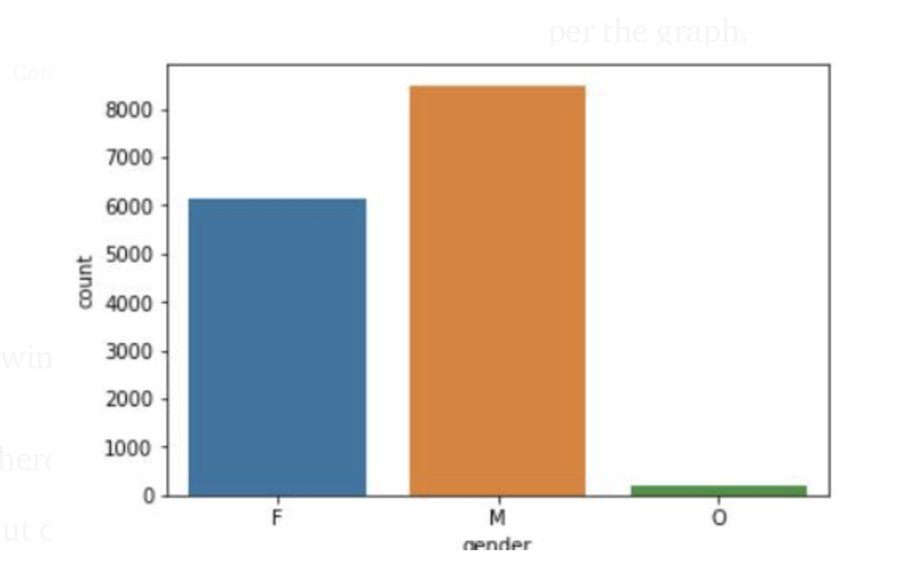
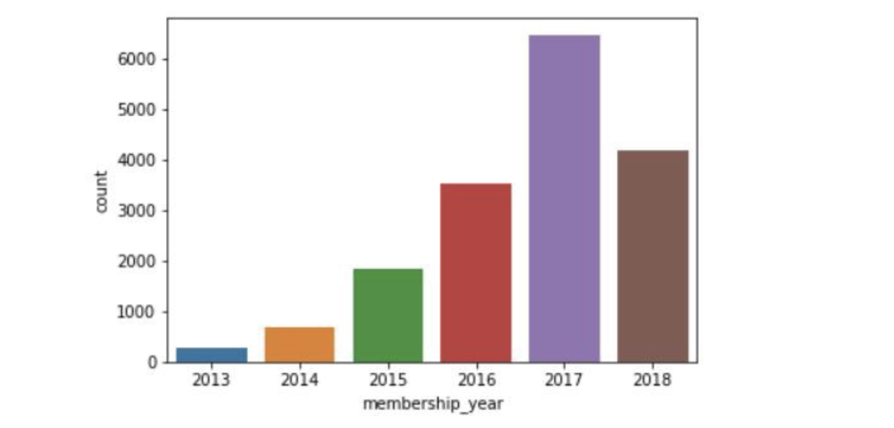
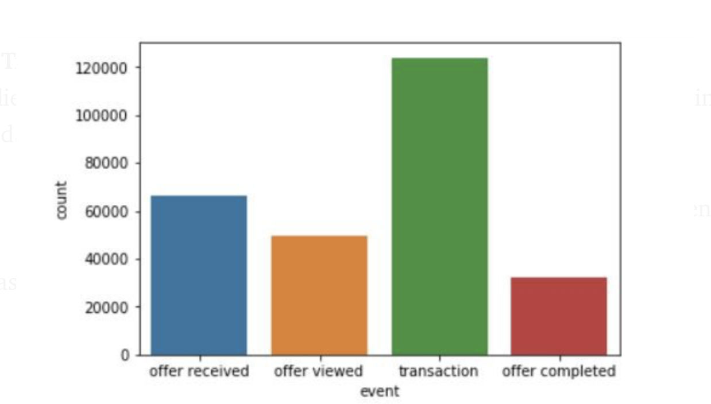
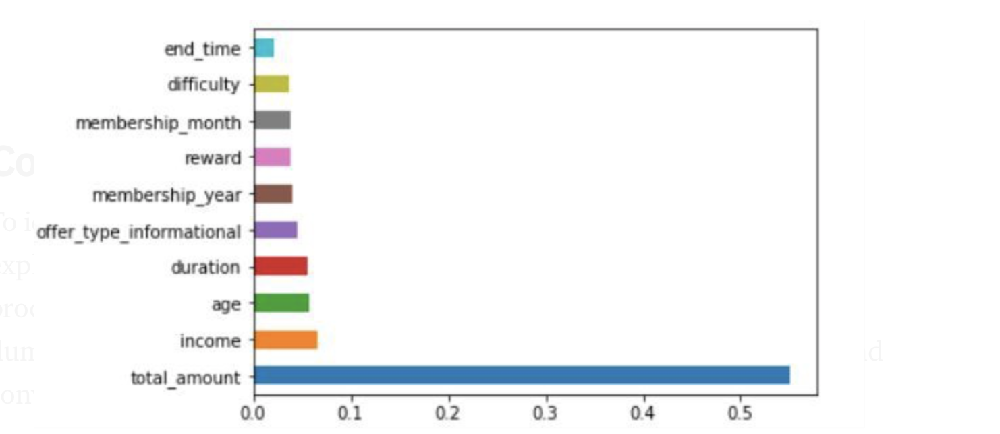

## Motivation
This is a Capstone project done as a requirement from Data Science Nano Degree, offered by Udacity. 
Goal of this project is to analyse Starbucks open source datasets and extract insights out of
it. 

## Overview
The provided data set contains simulated data that mimics customer behavior on the Starbucks 
rewards mobile app. Once every few days, Starbucks sends out an offer to users of the mobile app.
 An offer can be merely an advertisement for a drink or an actual offer such as a discount 
 or BOGO (buy one get one free). To give an example, a user could receive a discount offer 
 buy 10 dollars get 2 off on Monday. The offer is valid for 10 days from receipt. 
 If the customer accumulates at least 10 dollars in purchases during the validity period, 
 the customer completes the offer.
 
 Following data sets were provided:
 * **portfolio**: stores offer data such as offer_type, duration, channels etc.
 * **profile**: stores user data such as age, gender, income etc.
 * **transcript**: binds users in profile to offers in portfolio
 
Using these data sets following questions would be answered: 
* What are the main features responsible for a successful offer ?
* Given a set of features, can we predict if the offer would be a success ?

## Pre-requisites
* [python3](https://www.python.org/)
* [pandas](https://pandas.pydata.org/)
* [sklearn](https://scikit-learn.org/stable/)
* [numpy](https://numpy.org/)
* [matplotlib](https://matplotlib.org/)
* [seaborn](https://seaborn.pydata.org/)

## Files
* portfolio.json (stores offer related data)
* profile.json (stores user related data)
* transcript.json (stores transactions executed to/by the user)
* master_data.csv (stores the master dataframe generated during the project)

## Results
The following steps were executed to arrive at the solution:
1. Data Exploration: basic exploration of the datasets
2. Data Preprocessing: data wrangling & cleaning, to keep the data ready for ML model
3. Feature Engineering: extract new features from existing info that are helpful in 
data modeling step
4. Data Modeling: build a supervised learning model. We will use accuracy & MSE as metrics 
for evaluating the model’s efficiency

During Preprocessing step, many interesting observations were made.
A distribution of user demographic as per gender is as shown:

In our dataset, we have more Male users than other gender types.
 
 
Extracting membership_year depicts a good insight regarding the year that was most successful 
for Starbucks business.

 
Among the transactions done to/by the users, data shows:

That is, Users performed more transactions using the app. This means that there were many users
who did not receive any offer but were still generating businees for Starbucks.

In our Data modeling step, through our RandomForestClassifier we were able to obtain a 
Test accuracy of 91.69%. After this we could make following conclusions:
* There are some features more important than others. That is, amount spent or income earned by 
a user is more significant than other features such as offer_duration. Other features include:

* We can predict (with 91.69% accuracy) if an offer with some given set of features would be 
successful or not.

The methodology in detail have been published at 
[medium.com](https://medium.com/@gsn.06081990/know-your-customers-starbucks-capstone-challenge-48f4f50e0da3)

## References
https://stackoverflow.com/questions/43424199/display-rows-with-one-or-more-nan-values-in-pandas-dataframe
https://stackoverflow.com/questions/39778686/pandas-reset-index-after-groupby-value-counts
https://stackoverflow.com/questions/53645882/pandas-merging-101
https://stackoverflow.com/questions/33384529/difference-between-numpy-logical-and-and
https://towardsdatascience.com/hyperparameter-tuning-the-random-forest-in-python-using-scikit-learn-28d2aa77dd74
https://stackoverflow.com/questions/30102973/how-to-get-best-estimator-on-gridsearchcv-random-forest-classifier-scikit

